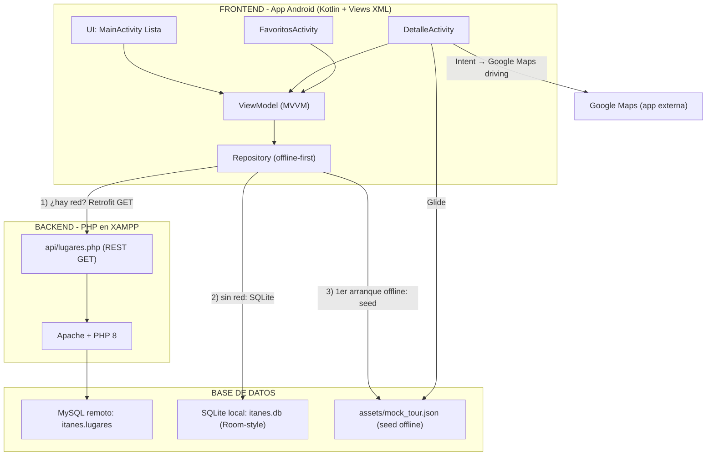

# Propuesta técnica ITANESTour (10 entregables obligatorios del caso práctico)

## 1) Diagrama general de arquitectura (Frontend, Backend, BD, APIs)



Fotos: las 5 imágenes reales viajan empotradas en el APK (`drawable-nodpi`), así el modo offline siempre las muestra. Con internet, `Glide` intenta la URL remota (`imagen_url`) y usa la local como `placeholder/error` (se "actualiza" con conexión).

## 2) Diseño de interfaces (wireframes de cada pantalla)

```
┌────────────────────────────┐  ┌────────────────────────────┐
│ PANTALLA 1: MainActivity    │  │ PANTALLA 2: DetalleActivity │
│ (Lista del recorrido)        │  │ (Ficha del lugar)           │
├────────────────────────────┤  ├────────────────────────────┤
│  ITANES Tour                │  │  [Foto real 220dp]          │
│  Cusco Imperial - 5 puntos │  │  ┌────────────────────┐     │
│  Offline first …            │  │  │   img (full width) │     │
├────────────────────────────┤  │  └────────────────────┘     │
│  [Ver mis favoritos]        │  │   NOMBRE DEL LUGAR          │
├────────────────────────────┤  │   Descripcion larga…         │
│  [  ] Foto [logo] Card 1    │  │  [Como llegar en auto →      │
│  [  ] Foto [logo] Card 2    │  │   Google Maps driving]      │
│  [  ] Foto [logo] Card 3    │  │  [Guardar favorito] (☆/★)  │
│  [  ] Foto [logo] Card 4    │  │  [Compartir]                │
│  [  ] Foto [logo] Card 5    │  │                             │
│  (tablet: 2 columnas)       │  └────────────────────────────┘
└────────────────────────────┘
┌────────────────────────────┐  ┌────────────────────────────┐
│ PANTALLA 3: Favoritos      │  │ PANTALLA 4: Google Maps    │
│ (solo SQLite local)        │  │ (Intent implícito, externo)│
├────────────────────────────┤  ├────────────────────────────┤
│  Mis favoritos              │  │  Ruta en auto (driving)    │
│  (n) favorito(s)            │  │  destino: LAT, LNG         │
│  [  ] Foto [logo] Card F1   │  │  Sin API key, abre Maps    │
│  [  ] Foto [logo] Card F2   │  │                            │
└────────────────────────────┘  └────────────────────────────┘
```

## 3) Estructura de la Base de Datos (tablas SQLite = MySQL remoto)

```
TABLA lugares (idéntica en MySQL itanes.lugares y en SQLite itanes.db)
┌──────────┬──────────┬─────────┬────────────┬─────────┬───────────┬───────┬──────────┐
│ id (PK)  │ nombre   │ descrip │ latitud    │ longitud│ imagen_url│ orden │ favorito │
├──────────┼──────────┼─────────┼────────────┼─────────┼───────────┼───────┼──────────┤
│ INT auto │ VARCHAR  │ TEXT    │ DOUBLE     │ DOUBLE  │ VARCHAR   │ INT   │ INT 0/1  │
└──────────┴──────────┴─────────┴────────────┴─────────┴───────────┴───────┴──────────┘
  PK: id            favorito: SOLO en SQLite local (preferencia del usuario, no se sube)
```

DDL SQLite (`ItanesDbHelper`):
```sql
CREATE TABLE lugares(
  id INTEGER PRIMARY KEY,
  nombre TEXT NOT NULL,
  descripcion TEXT NOT NULL,
  latitud REAL NOT NULL,
  longitud REAL NOT NULL,
  imagen_url TEXT NOT NULL,
  orden INTEGER NOT NULL,
  favorito INTEGER NOT NULL DEFAULT 0);
```

Relación: `1 recorrido → 5 lugares`. No hay tablas secundarias en el MVP (se puede añadir `recorridos` y `lugar_recorrido` como fase 2).

## 4) Ejemplo de consumo de API REST + procesamiento de JSON

Petición (Retrofit, emulador):
```
GET http://10.0.2.2/itanes/api/lugares.php
```
Respuesta (JSON de `lugares.php`):
```json
{"ok":true,"total":5,"data":[
  {"id":1,"nombre":"Plaza de Armas del Cusco",
   "descripcion":"Corazón histórico del Cusco...",
   "latitud":-13.516711,"longitud":-71.978823,
   "imagen_url":"https://commons.wikimedia.org/wiki/Special:FilePath/Plaza_de_Cusco_Allison_Bellido.jpg?width=800",
   "orden":1},
  {"id":5,"nombre":"Machu Picchu",
   "descripcion":"Maravilla del mundo...",
   "latitud":-13.163333,"longitud":-72.545556,
   "imagen_url":"...Machu_Picchu,_Peru_(2018).jpg?width=800","orden":5}
]}
```

Código: `ApiService.kt`
```kotlin
interface ApiService {
    @GET("api/lugares.php")
    suspend fun getLugares(): LugaresResponse   // { ok, total, data }
}
```
Procesamiento: `Retrofit + GsonConverterFactory` serializa JSON → `LugaresResponse → List<Lugar>` en una línea. Probado con Bruno `GET http://localhost/itanes/api/lugares.php` → 200 OK.

## 5) Flujo de navegación (Activities e Intents)

```
MainActivity ──startActivity(Intent putExtra "lugar")──▶ DetalleActivity
      │                                                     │
      │ startActivity(Intent)                                ├─btnRuta: Intent ACTION_VIEW
      ▼                                                     │   Uri "https://www.google.com/maps/dir/?api=1&destination=LAT,LNG&travelmode=driving"
FavoritosActivity ──── putExtra "lugar" ──▶ DetalleActivity  │   → Google Maps (Intent IMPLICITO)
      ▲                                                     └─btnCompartir: Intent ACTION_SEND (chooser)
      └── "Volver" (back stack natural, onBackPressed)        → botón fav: SQLite setFavorito
```
* **Intent explícito** = navego entre mis propias Activities (`Intent(this, DetalleActivity::class.java)`).
* **Intent implícito** = pido a otra app (`ACTION_VIEW` a Google Maps, `ACTION_SEND` para compartir). Es lo que cumple "rutas sugeridas en auto (con conexión a Google Maps o similar)" sin API Key.
* `Lugar` es `Serializable`, viaja en el `Bundle` (putExtra/getSerializableExtra).

## 6) Herramientas y librerías propuestas

| Capa | Librería | Versión | ¿Para qué? |
|---|---|---|---|
| UI Listas | RecyclerView + MaterialCardView | 1.3.2 / 1.14.0 | Cards de los 5 puntos, reciclaje de vistas |
| Arquitectura | Lifecycle ViewModel + LiveData | 2.8.6 | MVVM, sobrevive a rotación |
| Imágenes | **Glide** (elegida vs Picasso) | 4.16.0 | Carga remota + caché + placeholder local. Elegimos Glide por mejor caché y resize de memoria; Picasso también serviría |
| API | **Retrofit2 + Gson** (elegida vs Volley) | 2.11.0 | Tipado, coroutines suspend, JSON a objetos. Volley es más viejo, sin tipos |
| HTTP log | OkHttp logging-interceptor | 4.12.0 | Ver solicitudes en Logcat (evidencia) |
| Corrutinas | kotlinx-coroutines | 1.9.0 | Red/BD fuera del hilo principal |
| BD local | SQLiteOpenHelper (migrable a Room/KSP) | SDK | Almacenar 5 lugares + favoritos offline |
| Backend | PHP 8 + PDO (XAMPP) | 8.x | API REST JSON |

## 7) Cronograma tentativo de desarrollo (2 días, fecha límite mar 15)

| N° | Actividad | Sáb 12 | Dom 13 | Lunes 14 | Martes 15 |
|---|---|---|---|---|---|
|1|Config base (SDK 26, package, permisos)| X | | | |
|2|Backend PHP + BD + prueba Bruno| X | | | |
|3|SQLite + modelo + mock JSON| X | | | |
|4|UI Lista/Detalle/Favoritos/Maps + APK| | X | | |
|5|Documento, capturas, pruebas offline| | | X | |
|6|Entrega / revisiones| | | | X |

## 8) Estimación de requerimientos técnicos

* **Android 8.0 Oreo o superior** (`minSdk 26`), smartphone o tablet.
* **Memoria:** corre con 2 GB RAM (app ~8 MB).
* **Espacio:** APK ~ 9 MB (5 fotos empotradas ya van dentro).
* **Internet:** opcional. Sin internet funciona (SQLite + fotos empotradas). Con internet sincroniza PHP y fotos remotas.
* **Permisos:** `INTERNET`, `ACCESS_NETWORK_STATE` (no pide ubicación: menor riesgo de privacidad).
* **Backend:** XAMPP Apache+MySQL en red local; emulador usa `10.0.2.2`, físico usa IP LAN.

## 9) Diseño responsive (smartphone + tablet)

* `values/integers.xml` → `tour_grid_columns = 1` (smartphone: lista vertical).
* `values-sw600dp/integers.xml` → `tour_grid_columns = 2` (tablet >= 600dp: grid 2 columnas).
* Mismo `LugarAdapter` reutilizado en ambas; `GridLayoutManager + spanCount` leído por recurso.
* `item_lugar`: imagen 88dp fija (no crece en él), texto adapta con `layout_weight`. Detalle usa `ScrollView` + `match_parent` → escala a cualquier pantalla.

## 10) Verificación (checklist de evidencias)

- [x] APK funcional `app/build/outputs/apk/debug/app-debug.apk`
- [x] Código fuente documentado
- [x] Mock JSON `assets/mock_tour.json` (5 lugares)
- [x] API PHP probada con Bruno (200 OK, JSON 5 elementos)
- [x] Pruebas offline (modo avión: lista + fotos empotradas)
- [x] Repo GitHub `AvilioFT/ITANESTour-Cusco`
- [ ] Capturas de pantalla (pendiente tomar en emulador/tablet)
- [ ] Video corto simulando recorrido (opcional)